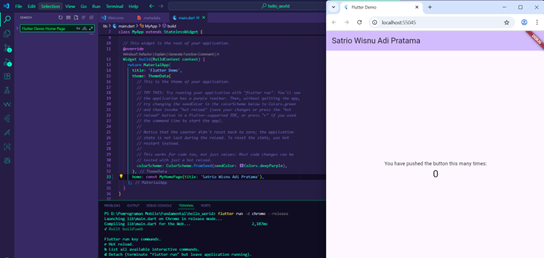
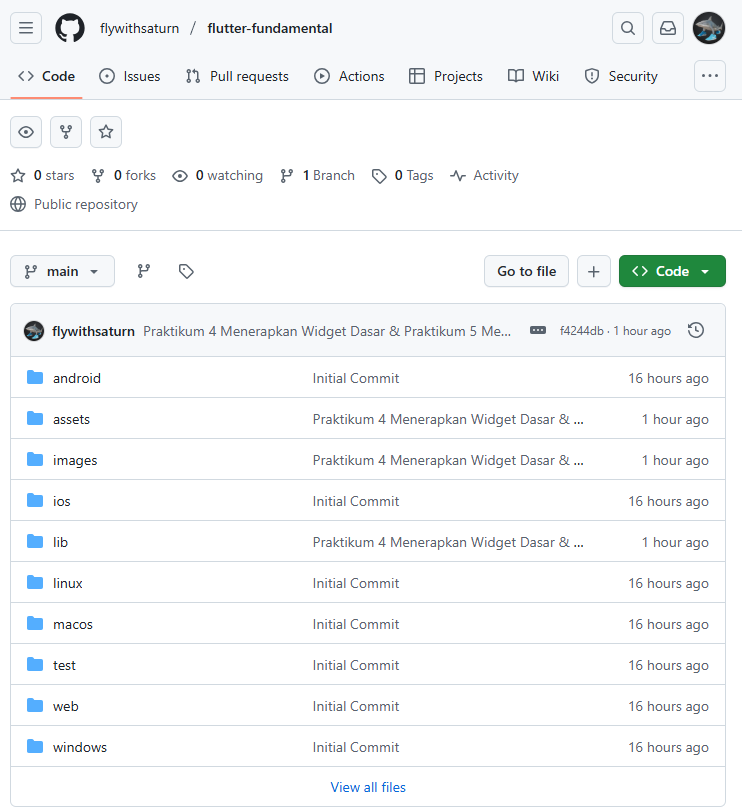
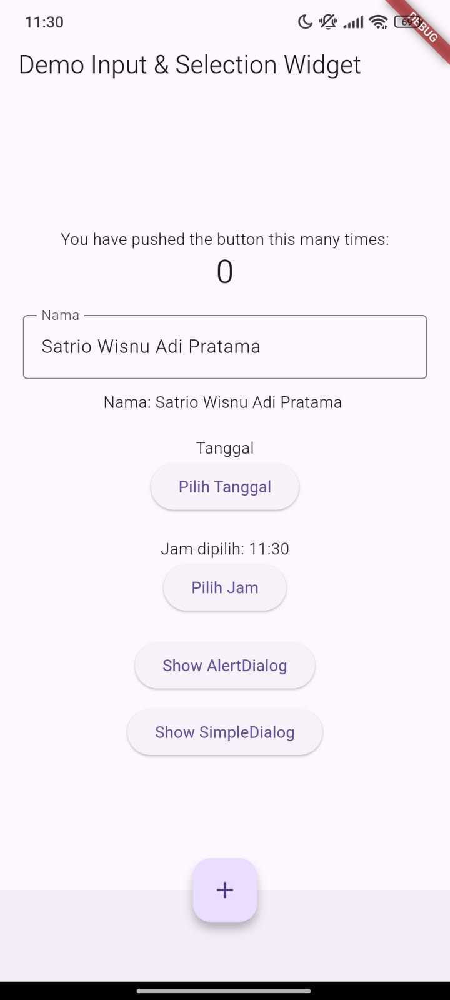

# hello_world

A new Flutter project.

## Getting Started

This project is a starting point for a Flutter application.

A few resources to get you started if this is your first Flutter project:

- [Lab: Write your first Flutter app](https://docs.flutter.dev/get-started/codelab)
- [Cookbook: Useful Flutter samples](https://docs.flutter.dev/cookbook)

For help getting started with Flutter development, view the
[online documentation](https://docs.flutter.dev/), which offers tutorials,
samples, guidance on mobile development, and a full API reference.

# Praktikum Flutter
# Satrio Wisnu Adi Pratama
# 2341720219

## Praktikum 1: Membuat Project Flutter Baru

- Membuat Project Baru Flutter.

## Praktikum 2: Menghubungkan Perangkat Android atau Emulator

- Menghubungkan android dengan emulator.

## Praktikum 3: Membuat Repository GitHub dan Laporan Praktikum

- Membuat repo di github
  

## Praktikum 4: Menerapkan Widget Dasar

- Membuat widget dasar
  

## Praktikum 5: Menerapkan Widget Material Design dan iOS Cupertino

- Membuat idget Material Design dan iOS Cupertino
  
